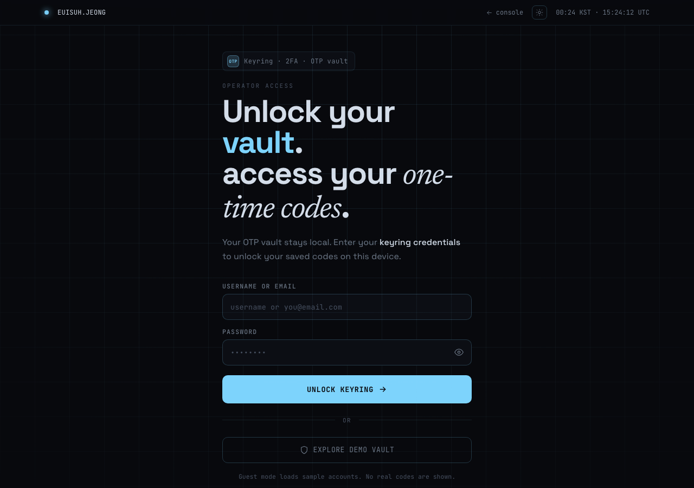
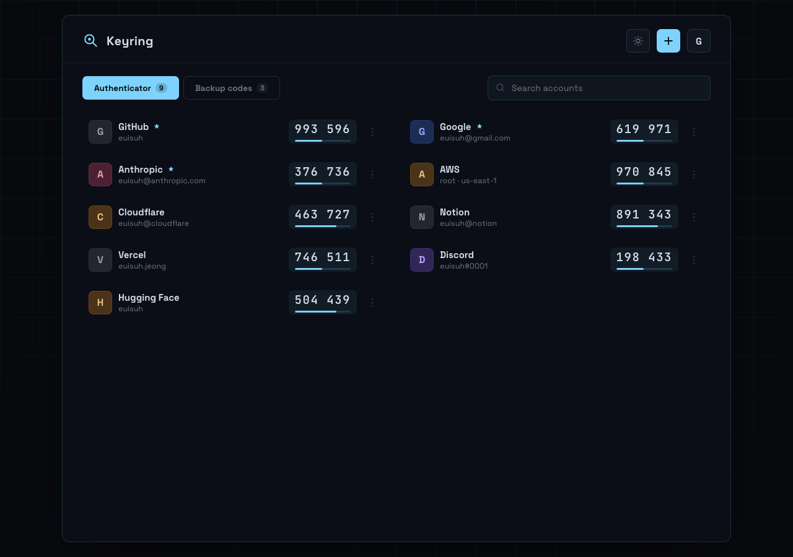

# Keyring

A client-side TOTP vault with AES-GCM encrypted localStorage, RFC 6238 OTP codes, and backup recovery code management. No cloud sync, no third-party dependencies for the vault itself.

**Live:** [uiseoya.com/credential?service=otp](https://uiseoya.com/credential?service=otp)

| Login | Vault |
|-------|-------|
|  |  |

## Features

- **RFC 6238 TOTP** — real `crypto.subtle` HMAC-SHA-1 for base32 secrets; deterministic hash fallback for demo seeds
- **AES-GCM-256 vault** — PBKDF2-SHA-256 (210 000 iterations) → AES-GCM. 12-byte random IV prepended to ciphertext, stored as base64 in `localStorage`
- **Backup codes** — per-service recovery code sets with tap-to-copy and used-state tracking
- **Demo mode** — `?demo=1` loads sample accounts without touching the real vault
- **Drag reorder** — HTML5 drag-and-drop to reorder accounts
- **Tweaks panel** — live accent color, density, layout, and theme switching

## Stack

| Layer | Technology |
|-------|------------|
| Frontend | Vanilla HTML + React 18 (UMD) + Babel standalone — no build step |
| Styles | CSS custom properties (dark/light themes, accent theming) |
| Crypto | `window.crypto.subtle` — PBKDF2 + AES-GCM + HMAC-SHA-1 |
| Auth backend | Flask 3 + Gunicorn (single `POST /keyring/api/auth` endpoint) |
| Server | nginx:alpine |
| Container | Docker + Docker Compose |

## How it works

```
Browser
  └─ /credential?service=otp    ← auth gate (credential/index.html + credential-app.jsx)
       │  POST /keyring/api/auth  ← nginx proxies to keyring-auth Flask service
       │  200 OK → sessionStorage handoff
       └─ /keyring/              ← vault app (keyring/index.html + keyring-*.jsx)
            │  TOTP codes via crypto.subtle (client only)
            └─ localStorage kr_vault ← AES-GCM encrypted vault
```

The vault never leaves the browser. The auth service only gates initial login — it does not store or see OTP secrets.

## Deploy

### Prerequisites

- Docker + Docker Compose
- nginx-proxy-manager (for production TLS — or remove the `npm` network and expose port directly)

### Steps

```bash
git clone https://github.com/euisuh/keyring.git
cd keyring
cp .env.example .env
# Edit .env: set KEYRING_CREDENTIAL=your@email.com:yourpassword
docker compose up -d --build
```

Runs on `127.0.0.1:8088` by default. In production, reverse-proxy through nginx-proxy-manager to add TLS.

If you don't use nginx-proxy-manager, remove the `npm` network block from `docker-compose.yml` and change the port binding to `0.0.0.0:8088:80`.

### Environment variables

| Variable | Description | Default |
|----------|-------------|---------|
| `KEYRING_CREDENTIAL` | Login credential in `identifier:password` format | `you@email.com:changeme` |

### Health check

```bash
curl http://localhost:8088/keyring/api/health
# {"status": "ok"}
```

### Local dev (no Docker)

Serve `public/` from a static server for the frontend:

```bash
python3 -m http.server 8080 -d public
```

For auth, run the Flask service separately:

```bash
cd auth
pip install flask gunicorn
KEYRING_CREDENTIAL=you@email.com:pw python app.py
```

Then visit `http://localhost:8080/credential?service=otp`. The auth POST will fail (different port) — use demo mode instead: `http://localhost:8080/keyring/?demo=1`.

## Structure

```
public/
  keyring/
    index.html          # Vault app shell — loads keyring-*.jsx via Babel
  credential/
    index.html          # Auth gate shell — loads credential-app.jsx
  keyring-lib.jsx       # TOTP engine, AES-GCM vault crypto, shared icons + components
  keyring-app.jsx       # Root vault app — auth routing, account list, vault persistence
  keyring-screens.jsx   # AccountRow, BackupCard, AddModal, AddBackupModal
  credential-app.jsx    # Auth gate — OTP service definition + login form
  tweaks-panel.jsx      # Floating tweaks shell (theme, accent, density, layout)
  favicon.ico / favicon.png / manifest.json / robots.txt
auth/
  app.py                # Flask auth endpoint
  requirements.txt
  Dockerfile
nginx.conf
Dockerfile
docker-compose.yml
.env.example
docs/
  architecture.md
```

## Security notes

- OTP secrets are stored AES-GCM encrypted in `localStorage`. The vault key is derived from your password at login and kept only in a JS `useRef` — it is never persisted.
- The Flask auth service reads credentials from an environment variable, never from disk or a database.
- nginx sends `X-Frame-Options: SAMEORIGIN`, `X-Content-Type-Options: nosniff`, and `Referrer-Policy: strict-origin-when-cross-origin` headers on all responses.
- The credential gate is marked `noindex, nofollow` in its meta tags. `robots.txt` also disallows `/credential` and `/keyring/`.

## License

MIT
